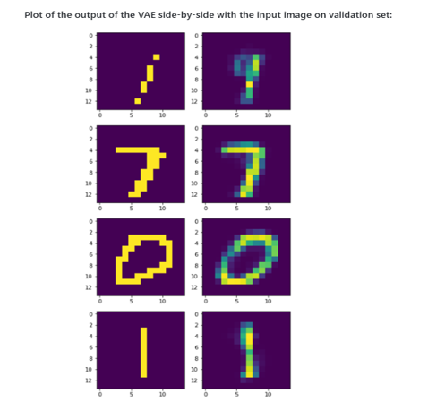

# Variational Autoencoder (VAE) for Handwritten Digit Recognition

## Project Overview

This project implements a Variational Autoencoder (VAE) to generate high-quality synthetic images of handwritten digits using the MNIST dataset. VAEs enable the compression of data into a latent representation and the generation of realistic images. The project improves upon traditional digit recognition techniques by leveraging VAEs to handle variations in handwriting styles and noisy data, ultimately enhancing model robustness and accuracy.

### Key Features:
- Compress and reconstruct handwritten digit images.
- Generate new, synthetic handwritten digits.
- Evaluate model performance using reconstruction loss and KL divergence.

---

## Motivation

The recognition and generation of handwritten digits have significant applications, such as improving accessibility for individuals with impairments and automating data entry processes. This project aims to enhance the accuracy and efficiency of these processes by employing a robust VAE model.

---

## Dataset

The project uses the MNIST dataset:
- **Training Set**: 60,000 images resized to 14x14 resolution.
- **Validation Set**: 1,000 images resized to 14x14 resolution.
- **Preprocessing**: Images are binarized (pixel value 0 for intensity < 128, 1 otherwise).

---

## Architecture

### Framework Overview

Below is the framework used in this project:

1. **Input Data**: MNIST dataset images.
2. **Encoder**: Compresses input images into a latent representation using linear layers with tanh activation.
3. **Latent Variables**: Mean (μ) and standard deviation (σ) calculated for latent representation.
4. **Sampling**: Uses the reparameterization trick (`z = μ + εσ`) to sample latent vectors.
5. **Decoder**: Reconstructs images from latent vectors using linear layers with tanh and sigmoid activations.
6. **Loss Function**: Combines Binary Cross-Entropy for reconstruction and KL Divergence for latent space regularization.

---

## Results

### Reconstruction Results
Below are examples of reconstructed images (side-by-side comparisons of original and reconstructed images):

#### Training Set:

#### Validation Set:

---

### Generated Digits
The following images show new handwritten digits generated by sampling from the latent space:

---

### Performance Metrics
The training performance is measured using:
- **Reconstruction Error**: Reduces over time as the VAE learns better representations.
- **KL Divergence**: Stabilizes quickly, ensuring a regularized latent space.

---
